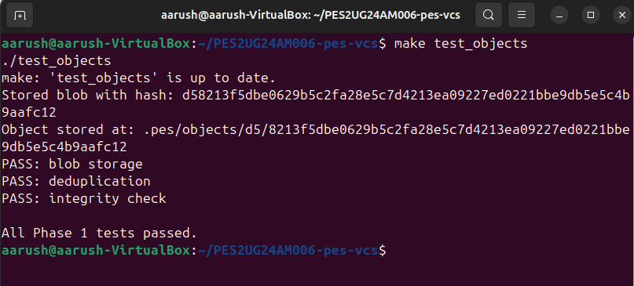
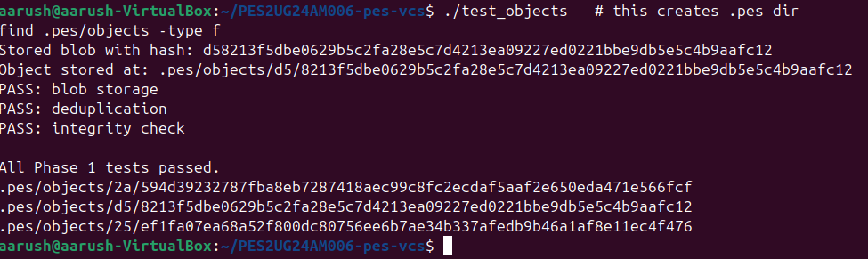
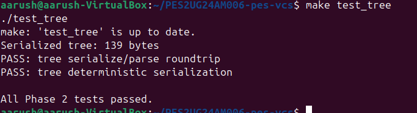
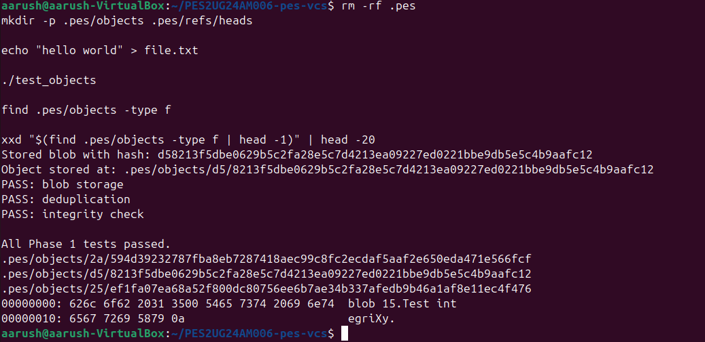
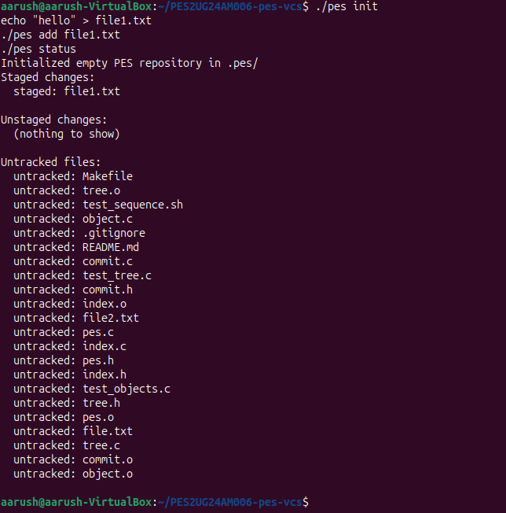
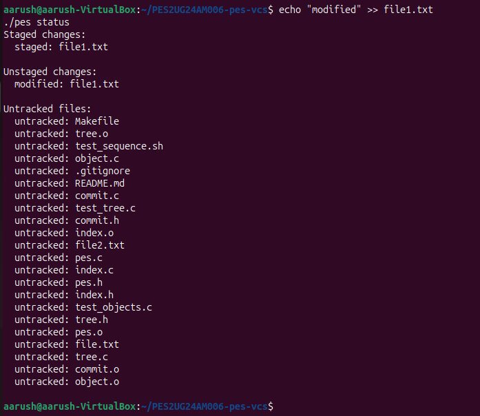
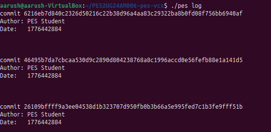
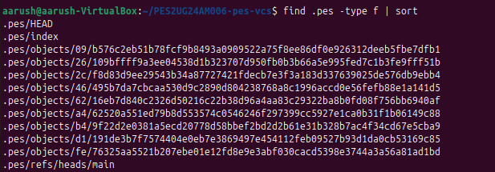
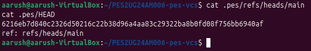
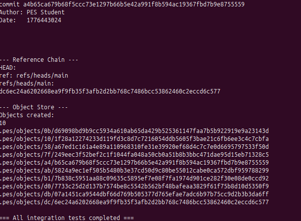

# PES-VCS: A Simplified Version Control System

## 📌 Overview

PES-VCS is a lightweight version control system inspired by Git. It implements core concepts such as object storage, trees, indexing (staging area), and commits using SHA-256 hashing.

The project is divided into multiple phases, each building upon the previous to simulate how Git internally manages files and version history.

---

## ⚙️ System Requirements

* Ubuntu 22.04
* GCC Compiler
* OpenSSL (libcrypto)

### Installation

```bash
sudo apt update
sudo apt install build-essential libssl-dev
```

---

## 🧠 Project Architecture

* **Object Store** → Stores blobs, trees, commits (content-addressable using SHA-256)
* **Index (Staging Area)** → Tracks files before commit
* **Tree Objects** → Represent directory structure
* **Commits** → Store snapshot + metadata + parent linkage

---

# 🚀 PHASE 1 — OBJECT STORAGE

### Features:

* Blob storage using SHA-256
* Deduplication
* Integrity verification

### Run:

```bash
make test_objects
./test_objects
```

---

### 📸 Screenshot 1A — All tests passing





---

### 📸 Screenshot 1B — Object storage structure

```bash
find .pes/objects -type f
```





---

# 🌳 PHASE 2 — TREE OBJECTS

### Features:

* Tree serialization and parsing
* Deterministic ordering
* Directory structure representation

### Run:

```bash
make test_tree
./test_tree
```

---

### 📸 Screenshot 2A — Tree tests passing





---

### 📸 Screenshot 2B — Raw tree object (hex dump)

```bash
xxd "$(find .pes/objects -type f | head -1)" | head -20
```





---

# 📂 PHASE 3 — INDEX & STATUS

### Features:

* Index load/save
* Staging files
* Status detection:

  * staged
  * unstaged
  * untracked
* Metadata-based change detection (mtime + size)

### Run:

```bash
./pes init
echo "hello" > file1.txt
./pes add file1.txt
./pes status
```

---

### 📸 Screenshot 3A — init → add → status





---

### 📸 Screenshot 3B — Index file format

```bash
cat .pes/index
```





---

# 📝 PHASE 4 — COMMITS & LOG

### Features:

* Commit creation
* Parent commit linking
* Tree snapshot storage
* Commit traversal (log)

### Run:

```bash
rm -rf .pes

./pes init

echo "hello" > file1.txt
./pes add file1.txt
./pes commit -m "first commit"

echo "world" >> file1.txt
./pes add file1.txt
./pes commit -m "second commit"

echo "again" >> file1.txt
./pes add file1.txt
./pes commit -m "third commit"
```

---

### 📸 Screenshot 4A — Commit log

```bash
./pes log
```





---

### 📸 Screenshot 4B — Object growth

```bash
find .pes -type f | sort
```





---

### 📸 Screenshot 4C — HEAD & branch reference

```bash
cat .pes/refs/heads/main
cat .pes/HEAD
```





---

# 🧪 FINAL INTEGRATION TEST

### Run:

```bash
make test-integration
```

---

### 📸 Final Screenshot — Integration success





## Q5.1 — Checkout Implementation
Read .pes/refs/heads/<branch> to get target commit hash
Read that commit's tree recursively
Update working directory files to match target tree (write/delete files)
Update .pes/HEAD to ref: refs/heads/<branch>
Update .pes/index to match new tree
Complexity: must handle file deletions (files in current tree but not target), directory creation/removal, and permission changes.

## Q5.2 — Dirty Working Directory Detection
For each file in index: stat() it and compare mtime + size to index entry
If mismatch → file modified in working dir
If target branch has different blob hash for same file → conflict
Refuse checkout if both are true (local modified + branch differs)
No re-hashing needed; metadata comparison is fast.

## Q5.3 — Detached HEAD
In detached HEAD, new commits exist in object store but no branch file points to them. If you switch away, commits become unreachable (orphaned). Recovery: run find .pes/objects -type f to list all objects, use object_read to find commit objects, reconstruct the chain manually, then create a branch pointing to the orphaned commit: echo <hash> > .pes/refs/heads/recovered

## Q6.1 — Garbage Collection Algorithm
1.Start from all branch refs + HEAD → get root commit hashes
2.BFS/DFS: for each commit, add its hash → read commit → add tree hash → recurse into trees → add blob hashes
3.Use a HashSet (hash table of ObjectID) for O(1) membership test
4.Walk all files in .pes/objects/ — delete any not in reachable set
Estimate for 100k commits, 50 branches:

Avg 10 files/commit = ~1M blob+tree objects
Must visit all ~1M objects in reachability pass
Total object visits ≈ 1–2M

## Q6.2 — GC Race Condition
GC scans reachable objects — finds object X is unreachable → marks for deletion
Concurrent commit writes new tree referencing object X → writes commit
GC deletes object X before commit finishes
Repository now has commit pointing to deleted object → corruption

Git avoids this by:

Using a grace period (objects newer than 14 days never deleted)
Lock files during ref updates
Two-phase GC: mark phase never deletes, sweep only after full scan

---

# 📊 GIT COMMITS REQUIREMENT

Each phase contains **5 commits**, totaling **20 commits**:

* Phase 1 → Object storage
* Phase 2 → Tree implementation
* Phase 3 → Index & status
* Phase 4 → Commit system

---

# 🧠 KEY CONCEPTS

* **Content-addressable storage** using SHA-256
* **Deduplication** of identical content
* **Tree structures** for directories
* **Index as staging layer**
* **Commit chaining using parent pointers**

---

# 📌 Conclusion

This project demonstrates how a version control system like Git works internally by implementing:

* Object storage
* Tree hierarchy
* Staging area
* Commit history

It provides a strong foundation for understanding distributed version control systems.

---
